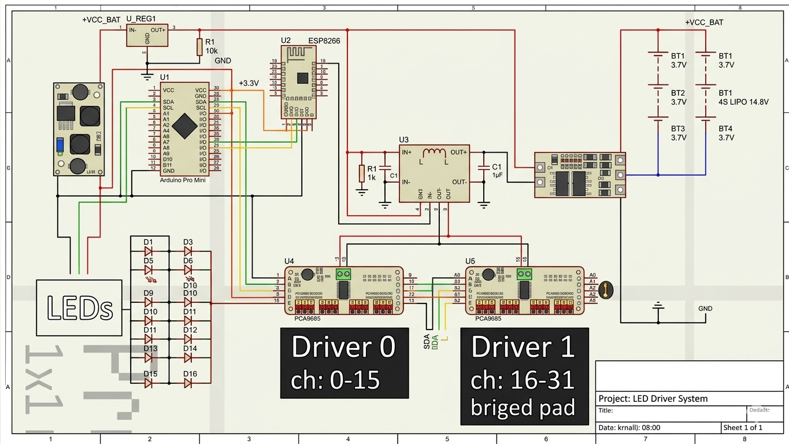
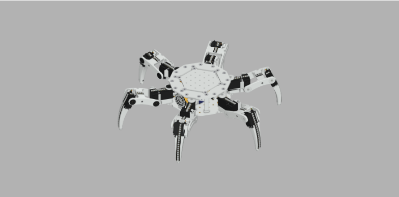
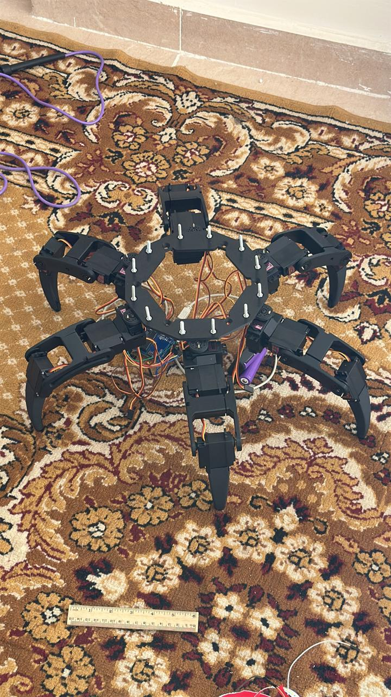

# 18-DOF Autonomous Hexapod Robot

## 📌 Overview

This project presents the design and implementation of a fully actuated 18-degree-of-freedom (DOF) hexapod robot capable of stable and coordinated locomotion. The system combines embedded control, inverse kinematics, and high-level motion planning to achieve smooth walking using biologically inspired gait patterns.

The robot is designed to address common challenges in multi-legged systems, including servo synchronization, real-time control, and scalable architecture for future autonomy.

---

## 🎯 Objectives

* Develop a stable multi-legged robotic platform
* Implement inverse kinematics for precise leg positioning
* Achieve smooth and synchronized motion across 18 actuators
* Integrate a scalable control architecture (embedded + ROS)

---

## 🚀 Key Features

* 18 DOF (6 legs × 3 joints per leg)
* Inverse kinematics-based motion control
* Tripod gait for stable locomotion
* Real-time servo synchronization using PCA9685
* Modular architecture (Arduino + ROS)
* Expandable for autonomous navigation

---

## 🧠 System Architecture

The system is divided into two main control layers:

### 🔹 Low-Level Control (Embedded System)

* Arduino Uno handles real-time actuation
* PCA9685 PWM driver generates stable signals for all servos
* Eliminates timing conflicts associated with software PWM

### 🔹 High-Level Control (ROS)

* Responsible for motion planning and gait generation
* Computes inverse kinematics for each leg
* Sends position commands to the embedded layer

### 🔹 ROS → Arduino → PCA9685 → Servos


---

## 🔩 Hardware Components

* Arduino Uno
* PCA9685 16/32-channel PWM driver
* 18 × Servo Motors
* External regulated power supply
* Custom-designed mechanical frame

---

## 💻 Software Stack

* Arduino IDE (C/C++)
* ROS (Robot Operating System)
* Python (ROS nodes & control logic)

---

## 🤖 Locomotion Strategy

### Inverse Kinematics

Each leg is modeled as a 3-DOF manipulator. Inverse kinematics is used to compute joint angles required to position the foot in 3D space.

### Gait Design

* Implemented **tripod gait**:

  * 3 legs in swing phase
  * 3 legs in support phase
* Ensures continuous stability during motion

### Motion Control

* All servos are updated simultaneously using I2C-based PWM control
* Smooth transitions achieved by interpolating joint trajectories

---

## 📊 Results

* Stable walking on flat terrain
* Smooth, synchronized motion across all joints
* Reliable real-time control without signal jitter
* Scalable architecture ready for further autonomy

---

## 📷 Media
## 📷 Project Preview





## 🎥 Videos
[Watch the robot move](https://youtube.com/shorts/7h3Il6gI8jU?feature=share)

[Robot ROS simulation (Joint State)](https://youtu.be/XgGaehNCocc)

[Robot simulation (URDF)](https://youtu.be/5gbO4OF5Jxg)

---

## 📁 Repository Structure

```plaintext
hexapod-robot-18dof/
│── README.md
│── images/
│── videos/
│── code/
│   ├── arduino/
│   ├── ros/
│── hardware/
│── docs/
```

---

## ▶️ How to Run

1. Upload Arduino control code
2. Connect PCA9685 via I2C
3. Power servos using external supply
4. Run ROS nodes
5. Send motion commands to robot

---

## 🧠 Engineering Highlights

* Solved servo timing limitations using dedicated PWM driver
* Designed modular control system (separation of high/low level)
* Implemented efficient IK for real-time performance

---

## 🔮 Future Improvements

* Terrain adaptation using sensors
* Vision-based navigation
* Closed-loop control with feedback
* Battery optimization

---

## 📬 Contact

For collaboration or inquiries, feel free to connect.
